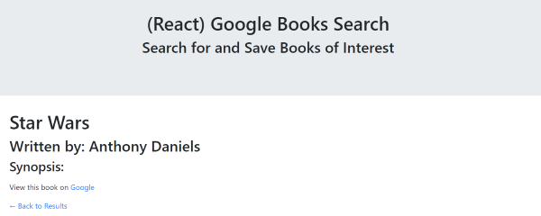

# google-book


## MERN Stack

Google Book is a MERN stack application utilizing the Google Books API.  Users can search for book titles, 10 of which are returned.  Books can be viewed in the Google Store, saved into a database for viewing later, and of course deleted as well.  From the saved page, by clicking on the book link, more detail can be viewed.

## Install

To run locally, fork the repo, and clone the repository.  Then, the npm dependencies need to be installed.  From the command line, type:

```npm install```

To run locally:

```node server.js```





## Dependencies Used

* React
* React-router-dom
* Axios
* Express
* If-env
* Mongoose

## Deployed on Heroku

[Heroku](https://google-book2020.herokuapp.com/search)


